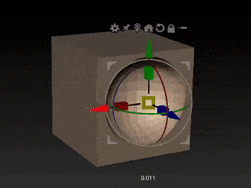

## Modelling from objects
NES pad!

[AAC202 Hard surface board on Pinterest \(register if you don't have a Pinterest account\)](https://www.pinterest.com.au/dmacdraws/aac202/hard-surface/)

## Exercise (together)
Begin modeling the snes controller. 
<!--   
Do I have to be able to understand and easily reproduce the wacom pen button modeling bit (including surrounds with crease) in zbrush to defensibly start with the snes pad? What about an NES pad? Or the radio/other boxier things?  
-->

### Plan

How would we model the nes pad? To make something this structured and with multiple pieces we need at least a rough plan.

### Body
Rounded box. There are some exceptions to this, we'll return to those in a minute.

### Buttons
Buttons have a variety of shapes, finishes and top surface profiles.

Buttons     |  Shape   |  Top profile  |   Material
----  | ---- | ---- | ----
A B | circle | concave (valley) | red shiny plastic
Start / Select | Line rounded ends | convex (hill) | black matte rubber
D Pad | plus | spherical concave&dagger; | black shiny plastic 

*&dagger; Like a large sphere has pushed down into the plus, leaving a rounded depression.*

## Files
Grab the project folder. This gives you an example project folder structure, which you need when you're combining multiple programs to get your results.

[Download nes_pad.zip](nes_pad.zip)

## Body as Rounded Box
Making the body.
* This isn't a soft squishy shape, the 6 faces of the pad (think cube) are all machine-flat, so our roundovers need to be fairly controlled.
* Are the rounded over edges all the same radius? The edges of the front face (where the controls are) vs the edges of the four corners on the sides?
* Does rounding the four corners cause problems when we go to round the front face edges?

## Body cutouts
There are several features on the body of the main pad that cut into the otherwise basic rounded rectangle shape. 
* Tray in middle for select/start - sep object, dip.
* Cable opening - sep object, trumpet/flared cylinder.
* Notch 
* Button openings? Around buttons there's a small gap, sharp cut.
* Screw holes in back
* Indent for sticker on back.

These could quickly make things complicated as we add loops to support the shapes. Eventually this might be your preferred method (it offers control), but for now we need something quicker and easier. We can use Live Booleans.

### Boolean operations

An interaction between volumes. You can combine them, subtract one from the other (cut a hole), or keep their overlap/intersection.

Boolean operations on 2D shapes. *credit: hackernoon.com* 

Boolean operations on 3D shapes *credit: simlab.com*

Live Booleans in Zbrush - real time preview as you work *credit: create3dart*

**Pros:** 
* Non destructive (while working live)
* machine-like results
* works on multiple objects at once, also separate groups of multiples.

Downside: The resulting geometry is not pretty or quad based. *credit: create3dart*

**Cons:** 
* You have to commit at some stage, and the result can be very gnarly geometry.  
* Performance takes quite a hit rendering live booleans
* Limits: not everything renders perfectly and it doesn't render in all modes.  

### Learning links

**ZBrush Docs**  
<http://docs.pixologic.com/user-guide/3d-modeling/modeling-basics/creating-meshes/live-boolean/basic-process/>  
  
**Create 3d art quick intro**  
<https://create3dart.com/using-live-boolean-in-zbrush/>  

**Pavlovic intros** 

  

  

<!-- 

## TODO: Is radio actually easier?

It doesn't have those shoulder buttons to worry about, or the off-angle start and option buttons needing bevels.
Maybe change how the middle is added so we're not as bothered by extra geo?
Adding flat colours early to help our eye.

## The rest

* Cut off bits of end cylinders
* bridge ends
* Add geo to middle alrea
* Making buttons
* Bevel around buttons? Can do later with booleans when we're more settled on their shape?
* Adding and tweaking d pad?

-->

## Homework

Keep working on nes pad model.

<!-- 
Plan feature a.
Implement a and b.
-->
Post progress in [Module 6 Discussion Forum - Your NES Pad Modelling Progress](https://torrens.blackboard.com/webapps/discussionboard/do/message?action=list_messages&course_id=_115852_1&nav=discussion_board_entry&conf_id=_246176_1&forum_id=_1064205_1&message_id=_2909653_1) *before* our next review & feedback sesion. 
