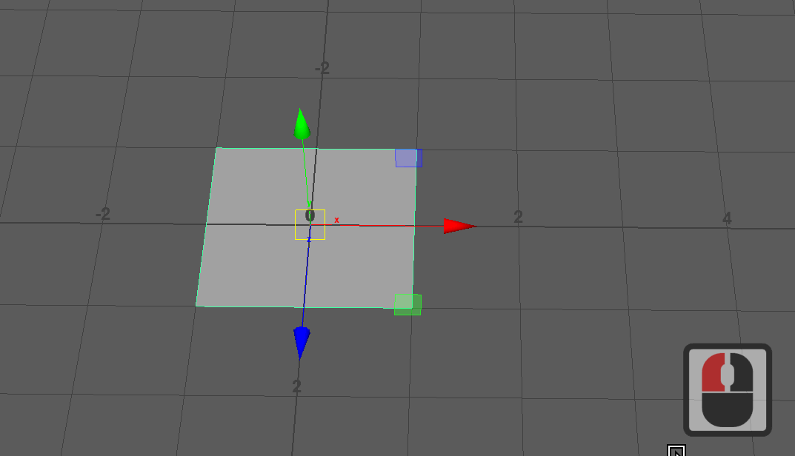
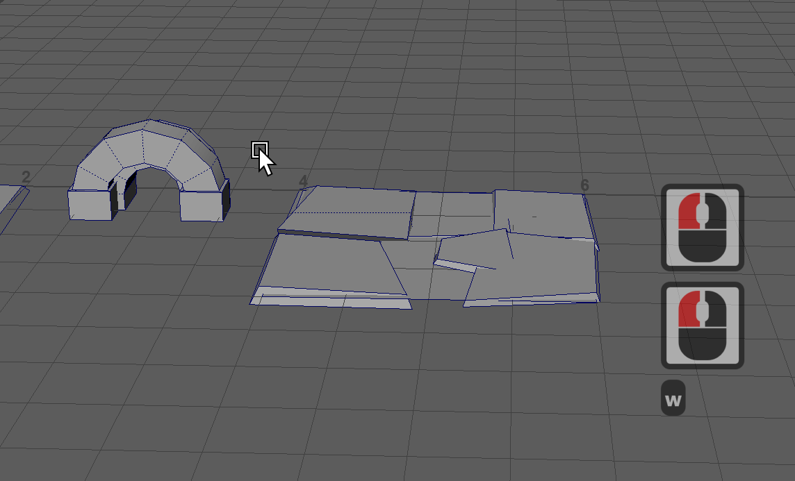
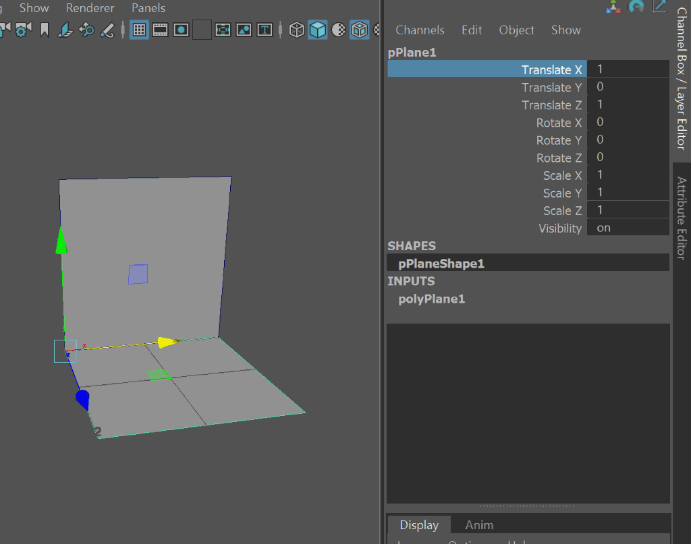

## Assessment 1 Received 

Thanks for assessment 1 submissions.
* Haven't yet looked through submissions. If I find major issues I'll let people know.

## Weeks 5-8, modeling game environments

We'll learn about:

#### Modular modelling
  - Assembling usable level pieces from basic components
  - components like floors, walls, columns, doors
  - level pieces like repeating wall with floor, corner of room etc

_Levels made from modules_

_Components for making modules_

| Objects     | Component     |
|------|--------|
| wall        | basic component |
| floor       | basic component |
| wall+floor  | wall_floor module |
| 2 walls + floor | wall_floor_corner module |
| 5 x wall_floor + column  | one side of a corridor? | 

## Wacom Tablets

Get one!

## This week

Beginning the assessment, practising working to a grid.

### Modules and components 

A little more context. 

_Notice one road lane component and one sidewalk component making up a module. Look for more._

_Components being arranged to make ledge/raised walkway modules_

## Modular modeling

<!--
> TODO: add this file
> First, play in this scene to see what we'll be doing.
>
> Make some modules by duplicating (ctrl-d) and moving components:
>  - select translate tool (w)
>  - enable grid snapping (hold down x)
>  - click and drag the translate handle
> -->

Making pieces that snap together means using standard measurements so they meet up at the corners. It also means choosing a pivot point for each part that makes sense.

* Set up grid

  
* Make a wall plane, a floor plane
* Move our pivot points using d (modify pivot)
  - select translate tool (w)
  - select an object
  - enable pivot editing (d)
  - you can move pivot freely by dragging handles
  - enable snap to vertex (hold down v), click and drag manipulator handles.
  - disable snap to vertex (release v)
  - disable pivot edting (d)
  

* Move and snap our objects. Duplicate, move w snap.
  - select translate tool (w)
  - enable grid snapping (hold down x)
  - click and drag the translate handle

When you have your pivot set, and your object at the origin, you're going to be stuck with funny x and z coordinates, and maybe leftover rotation. Remove them with "Freeze Transforms"
* Select your objects
* Right Click the channel box as in the gif below and freeze all transforms.

_Your new level component should be all 'zeroed out' with its pivot at the origin_

* Make a column
* Move pivot, duplicate, move w snap.

## Assessment 2: Environment Modelling

Assessment 2 brief [on blackboard](https://laureate-au.blackboard.com/webapps/blackboard/content/listContentEditable.jsp?content_id=_8920016_1&course_id=_91934_1)

 You will be choosing, interpreting, building and lighting a 3D environment. 
 
 * You'll be provided with a range of existing 2D environment concepts and finished 3d environment assets to use as a guide.
 * You can modify the scene from say a level 1 dungeon to level 5 dungeon, or a lounge room to an attic bedroom). * You can add elements that aren't there, but aim to match them stylistically
  
**OPTIONS**
1. Dungeon crawler world (games like diablo)
2. Interior scene:
   a. modern home interior
   b. fantasy interior
3. Cartoony tiered environment (see concepts)
4. Suggest and discuss with Danny (facilitator)

**TECH SPECS, CREATIVE DIRECTION**
1. Keep polycount low. Elements between 20 and 100 polys roughly.
2. Strong focus on modularity: reusable pieces, fitting to a grid, instancing.
2. UV unwrap models
3. Keep textures minimal with little lighting. Keep individual textures at 512x512 or lower (256, 128, 64)
4. Export to Unity and apply baked lighting (AO)

**DELIVERABLES:**
Week 6:
* Designs and first renders on class forum (blackboard)
* 10-15 untextured components, arranged into modules
Week 12:
* Unity project with interactive fly through (camera using a basic unity-provided controller script)
* Maya project

### How will we do it all?

- Choose and modify/extend a concept
- Model and uv unwrap in Maya
- Test with a texture designed to help uv mapping
- Export to 3D Coat/Photoshop for texturing.
- Import components to Unity
- Make simple prefabs
- Snap pieces together

## Due this week

First the assessment page lists **the exact images you need to submit.**

<a class="btn btn-lg btn-primary mr-3 mb-4" href="../assessments/#week-5-submission-details" target="_blank">What To Submit<i class="fas fa-arrow-alt-circle-right ml-2"></i></a>

Now, here's **what you'll do to create them.**

### How to do it.

**CHOOSE A CONCEPT**  
You're going to create a set of modular level pieces from a concept, including enough parts to make multiple parts of a level.


Click the image above to choose a concept. Do not choose the cgArt/DOFUS room, it's style reference.


  When you look through concepts, you're trying to see one that puts an idea in your head, and one wher you can identify enough pieces to make a modular level building kit. It might be 2 or 3 rooms and a corridor of a dungeon (with a purpose to those rooms), the royal chambers in a castle, a seafront docks area in a 3d platformer etc, a traveller's stopover in an rpg, whatever.  

  
**DRAW OVER IT**  

* Find and outline the pieces you can imagine pulling out.  
* Can you see tileable bits of floor and wall? Corner features you can use to cover overlap? Barriers, doorways, stairs, tables, statues, signs, trees? Are there things for players to climb between areas, traps to jump over? Think of a game you like, say Fez or Mario or uncharted: what parts do you need for areas to be fun?  
* Digital: Put the concept in a layer above a white background layer. Turn down the concept opacity. Draw outlines of your potential pieces.  
* Traditional: Fade the contrast, print it out, draw over it with pens.  
    
**SKETCH/DRAW, PIECES, AREAS**

  * You need **simple drawings of the pieces** you plan to make, and **also of the areas** you plan to make with them.   
  * The drawings don't have to be pretty, they have to be **clear** about size and construction. Drawings are way easier to cross out and redo than 3d models.  
  * This process is how you'll understand when you have the right pieces. Don't expect to imagine it all in your head, then model it.   
  * Think about our 1u squares, 2u sections of wall etc, you're making a kids toyset in a way.  
  * Make sure you have enough pieces to make more than one area of a level. A single bedroom or a corridoor with a treasure chest isn't enough, think how long a level of a game usually is!  

<a class="btn btn-lg btn-primary mr-3 mb-4" href="../assessments/#week-5-submission-details">What To Submit<i class="fas fa-arrow-alt-circle-right ml-2"></i>
</a>

**Example kits:**


Click the image to check out this kit on the unreal store. It's amazing what you can do with a few well considered pieces.


I saw the pieces, and, giving myself the "not much time" excuse, didn't sketch out a scene to build from them. As always, "not much time" meant the sketch was even more important. I ended up wasting time modeling the wrong things and noodling trying to "make something happen", a euphemism for trying to pull something out of your.. hat.

