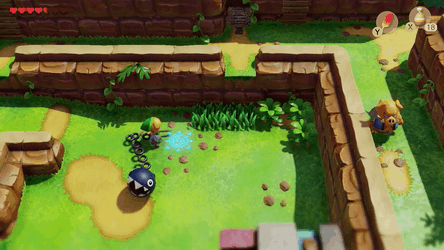

Must cover:

Memory heirarchy: Lots of storage in a compute with diff speeds.
  
_CCCS: memory heirarchy_  

## What is the cache? (needs pre-reading really)
How does it work roughly? You want a bit of memory, it gets a chunk.
Cache lines and their size.

### Locality! 
Data locality, time locality. Both similar but different.
Data you use tends to be close to other data you'll use.
Data you use now tends to be close to other you'll use.
A character is wandering a map. You need to load it into memory so you can check if they walk into walls, fall off things, and of course to render the map on screen. 
That bit of map is in memory somewhere, along with the rest of the tiles.
Unless you teleport or exit the map, the next places you'll visit will be parts of the map next to your current area. (need pictures)
So, you can predict the next bit of memory you need is going to be parts of this map that are close by, and they happen to be close together in memory! That's locality.
It also explains why, when you're done with a map, there's often a bit of load time. Also, why teleporters often make dramatic sounds and stuff before they transport you: it buys some time for the next bit of map to load into memory/cache.

  
 
_Awesome effect or suspicious stalling? Both!_

### Caching often used memory
Since we're going to be smashing those bits of memory over and over, because we keep going back to the store and then grinding for nearby gems, we need
(good example for cache access in future, how to grab map tiles).

If you access memory for one part of a game map so your can render it, 
So: Over the lifetime of a program you often use data that's near other data, and often close together in time.

### std::Vectors vs std::Arrays vs C arrays
c arrays are declared in straight line, they're basicly direct access to memory without any help. Dangerous, clunky, but with blistering speed.
stack vs heap (errors if we load too much into a regular variable).
the `new` keyword in c++. Cover it lightly, but know we need it for big arrays. We'll come back to it.

## Code

Give out load and sort code (slow). 

### timing
If we're speeding stuff up, we need code for measuring how long stuff takes.
Microsoft has special library for it. I've coded it, you just need to use it.

### multi d arrays

2d, 3d, 4d. How do we hit them so that we are accessing stuff in the cache.

Cache is so small it's easy to go to data that isn't in it, just by picking the wrong row or column!

Especially when you're **loading 100k or 1 million numbers, like we are.**

----

## Memory

Memory is just anything that keeps information in the computer. Programs only care how fast each one is. You also worry about if it holds information after the pc powers off.

How is speed measured?
 - Access time: How long from my first request to the first data received
 - Bandwidth: How much cames in over what time

**_Fastest_ to _slowest_**
Registers
Cache
DRAM (your DDR4 rgb _HyperWolf Ninja King_ ram)
Solid State Drive (ssd)
Hard Disk Drive (spinning rust)
Cloud Drive folder

## Oh look, Matrices

Row, row, row your matrix,  
gently through the cache.

$$ \begin{bmatrix} 
    2  & 8  & 5  \\\\ 
    11 & 1  & 56 \\\\
    34 & 1  & 14 
    \end{bmatrix} $$